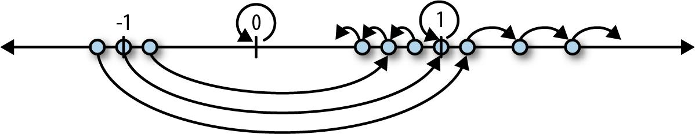
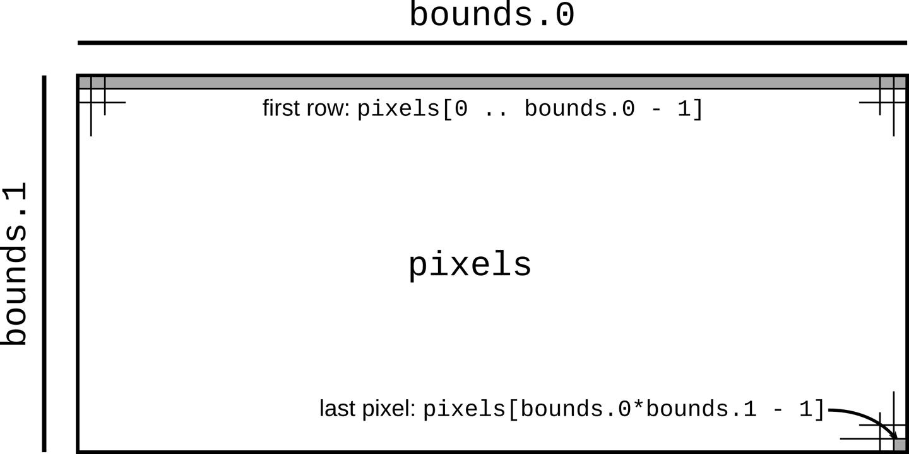
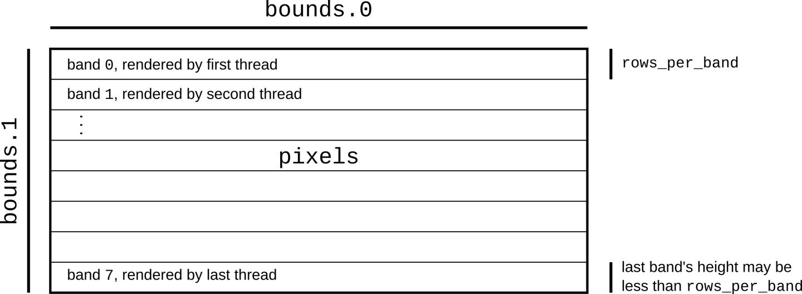

% Rust Concurrency - Generating the Mandelbrot Set
% Ian Channing <https://github.com/ianchanning/mandelbrot>
% March 10, 2021

# Taken from the Rust Book

Based on the Concurrency section of Chapter 2 (A Tour of Rust)

from the O'Reilly "Programming Rust" book.

Extra concurrency algorithms from <https://github.com/ProgrammingRust/mandelbrot>

# Introduction

Rust.

Complex numbers and iterating complex numbers.

The Mandelbrot set.

Generating the Mandelbrot set with one processor.

The required changes to use multiple processors.

Fearless concurrency.

# Rust

### Fearless Concurrency

For experienced parallel programmers - faster development

For inexperienced - can gain the benefits without the danger

### Borrow Checker

Immutable - no problem

Mutable within one function - no problem

Passing mutable values between functions - enforced rules

# Iterating over the real numbers

A simpler, but very similar iteration

$$
\begin{aligned}
z_{n+1} &= z_n^2 \\
\end{aligned}
$$

We can do the same for complex numbers

# Complex numbers and iterating complex numbers

Addition

$$
\begin{aligned}
(a+bi)+(c+di)=(a+c)+(b+d)i \\
\end{aligned}
$$

Multiplication

$$
\begin{aligned}
(a+bi)\times(c+di) &= ac+(ad+bc)i+bdi^2 \\
& = (ac-bd)+(ad+bc)i \\
\end{aligned}
$$

# The Mandelbrot set

An easy way to generate fractals

Complex number $z$

$$
\begin{aligned}
z &= a+bi \\
\end{aligned}
$$

Iterate $z$ from 0, square it and add another complex number $c$

$$
\begin{aligned}
z_0 &= 0 \\
z_{n+1} &= z_n^2+c \\
\end{aligned}
$$

For some values of $c$, $z$ will stay within a distance of 2 from the origin

Those are 'in' the Mandelbrot Set

# Mandelbrot set with one processor

Flatten out the 2D image into one very long array

# Multiple processors

Parallel thinking

# Fearless concurrency

Switch to parallel code with little changes

Mutexs - dangerous in other languages but safe in Rust

Specialised parallel constructs
